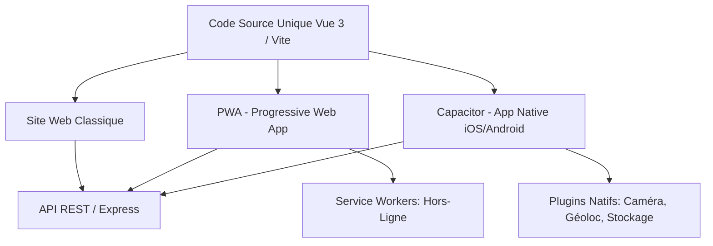

# Spécification Technique & Guide de Démarrage : Application Web-Mobile Vue.js (Capacitor & PWA)

Ce document de conception définit l'architecture complète, la configuration technique, les normes d'accessibilité (WCAG 2.2 AA) et la documentation de l'API (OpenAPI 3.1) pour concevoir et développer une application avec **Vue 3** prête à passer du Web au Mobile.

---

## 1. Architecture Générale (Web-to-Mobile)

Pour assurer une base de code unique capable de tourner sur le Web, en PWA et en tant qu'application native mobile (Android/iOS), nous adoptons l'architecture suivante :



### Structure Réelle de votre Dossier (Adaptée Mobile)
```text
cheloniens_groupe2/           # Racine du projet
├── backend/                  # Serveur Express (API)
│   ├── src/
│   │   ├── server.ts
│   │   └── openapi.yaml
│   └── package.json
├── src/                      # Code source Electron (Bureau)
│   ├── main/
│   ├── preload/
│   └── renderer/             # VOTRE APPLICATION VUE 3 (Source de l'app mobile !)
│       ├── src/              # Composants, Vues, Router, App.vue de l'interface
│       └── index.html
├── out/                      # Dossier généré après compilation
│   └── renderer/             # Web Assets compilés par Vite (cible pour le mobile)
├── android/                  # Projet natif Android (Généré par Capacitor à la racine)
├── ios/                      # Projet natif iOS (Généré par Capacitor à la racine)
├── capacitor.config.json     # Configuration de Capacitor (à la racine)
├── electron.vite.config.ts   # Configuration Vite partagée
└── package.json              # Fichier de dépendances racine
```

---

## 2. Guide d'Adaptation & Commandes pour votre Projet Actuel

Votre application Vue 3 étant déjà existante dans le dossier `src/renderer/`, vous n'avez pas besoin de réinitialiser un nouveau projet Vue. Vous allez greffer **Capacitor** directement à la racine de votre projet actuel.

### Étape 1 : Installer Capacitor (Version 6 pour compatibilité Node)
Depuis la racine de votre projet (`cheloniens_groupe2`), installez le Core et le CLI en version 6 (requis pour votre version actuelle de Node.js v21.4.0) :
```bash
npm install @capacitor/core@6 @capacitor/cli@6
```

### Étape 2 : Initialiser la configuration mobile
Vous devez configurer Capacitor pour qu'il récupère les fichiers HTML/JS/CSS compilés par Vite. Dans votre projet utilisant `electron-vite`, le build de l'interface Vue est placé dans `out/renderer`.

Exécutez cette commande à la racine :
```bash
npx cap init "Chelonians App" "com.ifremer.cheloniens" --web-dir=out/renderer
```
*Note : Cela va générer un fichier `capacitor.config.json` à la racine.*

### Étape 3 : Ajouter les plateformes Android et iOS
Installez les packages natifs correspondants en version 6 (pour correspondre à la version du CLI et du Core) et générez les répertoires de build natifs :
```bash
# Installer les plateformes Capacitor v6
npm install @capacitor/android@6 @capacitor/ios@6

# Générer les dossiers natifs /android et /ios
npx cap add android
npx cap add ios
```

### Étape 4 : Processus de Build & Synchronisation
Chaque fois que vous modifiez votre code Vue dans `src/renderer/`, voici le flux de travail pour mettre à jour l'application mobile :
```bash
# 1. Compiler l'interface web (Vite compile dans out/renderer)
npm run build

# 2. Copier les fichiers compilés de out/renderer vers les dossiers mobiles
npx cap sync
```

Pour lancer et tester dans l'émulateur ou sur votre téléphone physique :
```bash
# Ouvrir dans Android Studio
npx cap open android

# Ouvrir dans Xcode (sur macOS)
npx cap open ios
```

### Étape 5 : Neutralité de la Plateforme (Electron vs Mobile)
Dans votre code d'interface dans `src/renderer/src`, vous devez vous assurer de ne pas appeler des APIs spécifiques à Electron (comme `window.electron`) sur mobile sous peine de faire planter l'application.

Ajoutez une vérification de sécurité :
```typescript
const isDesktop = typeof window !== 'undefined' && 'electron' in window;

if (isDesktop) {
  // Code spécifique à l'application de bureau Electron
  window.electron.ipcRenderer.send('ping');
} else {
  // Code pour le Web ou le Mobile (ex: Plugins Capacitor)
}
```

### Étape 6 : Installer les Plugins Natifs Communs
Pour accéder aux fonctionnalités du smartphone dans votre interface Vue :
```bash
# Caméra (prendre en photo les tortues)
npm install @capacitor/camera

# Géolocalisation (récupérer les coordonnées GPS du signalement)
npm install @capacitor/geolocation

# Stockage Local Sécurisé (remplace LocalStorage de manière pérenne)
npm install @capacitor/preferences
```

---

## 3. Configuration de la Progressive Web App (PWA)

Pour rendre l'application web installable sur mobile sans passer par les stores, nous utilisons le plugin Vite PWA.

### Installation
```bash
npm install vite-plugin-pwa -D
```

### Configuration dans `vite.config.ts`
```typescript
import { defineConfig } from 'vite'
import vue from '@vitejs/vue'
import { VitePWA } from 'vite-plugin-pwa'

export default defineConfig({
  plugins: [
    vue(),
    VitePWA({
      registerType: 'autoUpdate',
      includeAssets: ['favicon.ico', 'apple-touch-icon.png', 'masked-icon.svg'],
      manifest: {
        name: 'Chelonians Observation App',
        short_name: 'Chelonians',
        description: 'Application de signalement de tortues en Martinique pour l\'IFREMER',
        theme_color: '#005e8c',
        icons: [
          {
            src: 'pwa-192x192.png',
            sizes: '192x192',
            type: 'image/png'
          },
          {
            src: 'pwa-512x512.png',
            sizes: '512x512',
            type: 'image/png',
            purpose: 'any maskable'
          }
        ]
      },
      workbox: {
        // Stratégie de mise en cache hors-ligne
        globPatterns: ['**/*.{js,css,html,ico,png,svg,woff2}']
      }
    })
  ]
})
```

---

## 4. Guide de l'Accessibilité (Conformité WCAG 2.2 AA)

Pour un site web passant sur mobile tactile, le respect de l'accessibilité est primordial.

### Checklist d'implémentation dans Vue 3 :

| Critère | Description | Implémentation Vue 3 |
| :--- | :--- | :--- |
| **Cibles Tactiles** | Taille minimale de clic/touche. | CSS : Boutons et liens à `min-width: 44px; min-height: 44px;` |
| **Lecteur d'écran** | Description des boutons icônes. | `<button aria-label="Fermer le menu"><svg aria-hidden="true">...</svg></button>` |
| **Gestion du Focus** | Empêcher la perte du focus dans les modales. | Utiliser `vue-focus-lock` ou la directive native pour capturer le focus dans les boîtes de dialogue de connexion. |
| **Labels de Formulaires** | Chaque champ de formulaire doit avoir un label lié. | `<label for="obs-date">Date</label><input id="obs-date" type="date">` |
| **Changements de Vues** | Les lecteurs d'écran doivent être avertis des changements de page. | Utiliser un composant d'annonce d'itinéraire (`route-announcer`) ou modifier le titre de la page sur chaque transition de routeur. |

### Exemple de composant de formulaire accessible (`ObservationForm.vue`)
```vue
<script setup lang="ts">
import { ref } from 'vue';

const species = ref('');
const description = ref('');
</script>

<template>
  <form class="accessible-form" @submit.prevent>
    <h2>Signaler une tortue</h2>

    <!-- Input accessible avec label explicite et aria-describedby -->
    <div class="form-group">
      <label for="species-select">Espèce de tortue observée *</label>
      <select 
        id="species-select" 
        v-model="species" 
        required 
        aria-required="true"
      >
        <option value="">Sélectionnez une espèce...</option>
        <option value="imbriquee">Tortue imbriquée</option>
        <option value="verte">Tortue verte</option>
        <option value="luth">Tortue luth</option>
      </select>
    </div>

    <div class="form-group">
      <label for="desc-input">Détails de l'observation</label>
      <textarea 
        id="desc-input" 
        v-model="description" 
        aria-describedby="desc-help"
      ></textarea>
      <span id="desc-help" class="help-text">Indiquez l'état de la tortue ou des détails physiques.</span>
    </div>

    <!-- Taille de cible tactile conforme (min 44px de hauteur) -->
    <button type="submit" class="submit-btn" aria-label="Soumettre le signalement de la tortue">
      Envoyer le signalement
    </button>
  </form>
</template>

<style scoped>
.form-group {
  margin-bottom: 1.5rem;
  display: flex;
  flex-direction: column;
}
label {
  font-weight: 600;
  margin-bottom: 0.5rem;
}
select, textarea {
  padding: 0.75rem; /* Facilite la saisie sur mobile */
  border: 2px solid #ccc;
  border-radius: 4px;
}
select:focus, textarea:focus {
  outline: 3px solid #005e8c; /* Focus visible */
}
.submit-btn {
  min-height: 48px; /* Cible tactile supérieure à 44px */
  background-color: #005e8c;
  color: white;
  font-weight: bold;
  border: none;
  border-radius: 8px;
  cursor: pointer;
}
.submit-btn:focus-visible {
  outline: 3px solid #ffa500;
}
</style>
```

---

## 5. Documentation de l'API & Code-Gen (OpenAPI 3.1)

Pour garantir une intégration sans erreurs entre l'application Vue.js mobile et le serveur Backend, nous utilisons une approche **Contract-First** avec OpenAPI 3.1.

### Spécification API : `backend/src/openapi.yaml`
```yaml
openapi: 3.1.0
info:
  title: API Chelonians Observation
  version: 1.0.0
  description: API pour gérer les observations de tortues et la synchronisation hors-ligne.
paths:
  /api/observations:
    post:
      summary: Enregistrer une observation de tortue
      operationId: postObservation
      requestBody:
        required: true
        content:
          application/json:
            schema:
              $ref: '#/components/schemas/Observation'
      responses:
        '201':
          description: Observation enregistrée avec succès
          content:
            application/json:
              schema:
                $ref: '#/components/schemas/ObservationSuccess'
components:
  schemas:
    Observation:
      type: object
      required:
        - species
        - latitude
        - longitude
      properties:
        species:
          type: string
          enum: [imbriquee, verte, luth]
        latitude:
          type: number
          format: float
        longitude:
          type: number
          format: float
        description:
          type: string
        date:
          type: string
          format: date-time
    ObservationSuccess:
      type: object
      properties:
        id:
          type: string
        status:
          type: string
          example: "saved"
```

### Automatisation du Typage TypeScript (DX)
Pour s'assurer que le frontend Vue respecte le contrat d'API, on utilise `openapi-typescript` pour générer automatiquement les types.

1. **Installer l'outil de génération** :
   ```bash
   npm install openapi-typescript -D
   ```
2. **Ajouter un script dans `package.json`** :
   ```json
   "scripts": {
     "generate-types": "openapi-typescript ../backend/src/openapi.yaml -o src/types/api.ts"
   }
   ```
3. **Utilisation dans vos composants Vue** :
   ```typescript
   import { components } from '@/types/api';
   
   type Observation = components['schemas']['Observation'];
   
   const newObs: Observation = {
     species: 'verte',
     latitude: 14.6,
     longitude: -61.0
   };
   ```

---

## 6. Stratégie de Synchronisation Hors-ligne (PWA & Mobile)

Pour les agents sur le terrain sans connexion réseau en Martinique :
1. **Détection du réseau** : Écouter l'état du réseau avec Capacitor.
   ```typescript
   import { Network } from '@capacitor/network';
   
   Network.addListener('networkStatusChange', status => {
     if (status.connected) {
       // Déclencher la synchronisation des données stockées localement
       syncDataWithServer();
     }
   });
   ```
2. **Stockage Local** : Utiliser **Pinia** avec un plugin de persistance (ex: `pinia-plugin-persistedstate` configuré avec `@capacitor/preferences`) pour enregistrer temporairement les observations localement.
3. **Synchronisation** : Dès que la connexion est rétablie, envoyer les requêtes stockées en file d'attente vers le point d'accès API `/api/sync/observations`.
